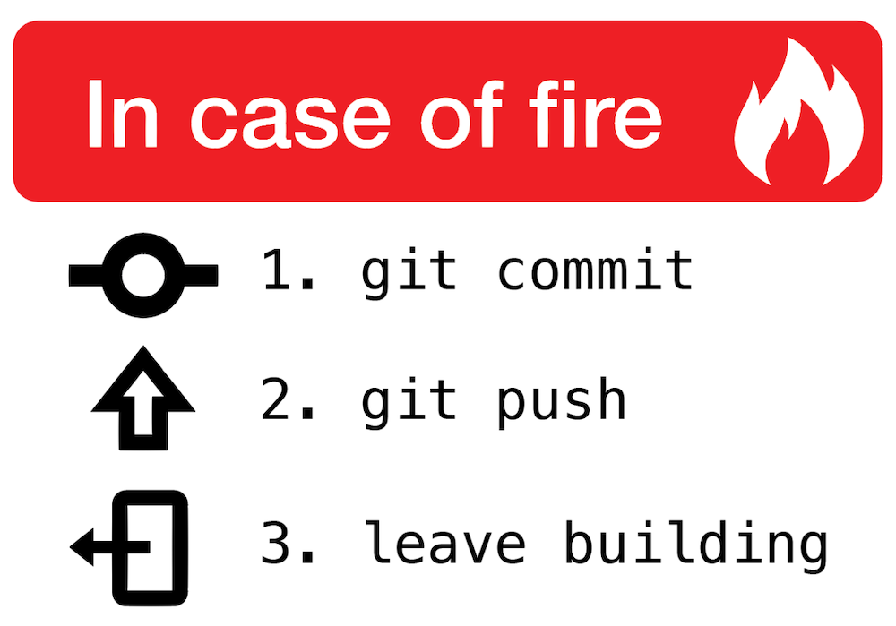

# Grants Awesome Journey 
##  Onboarding 
### Week ☝️ 

 Week one *was not* what I expected. We dove straight into Git & Github and I had been preparing for HTML & CSS. I am excited to learn more about mastering Github, along with markdown. These two things are completley new to me. I will also be very excited to learn about styling this blog. One thing about me personally is [K.S.R.](https://kentuckysportsradio.com) is my favorite website. I am excited for my opportunity in this class, to have a new valuable skill. Some things I learned in week one:
* Codeanywhere
  * Text Editing
  * Markdown language
* Grasshopper
  * Fundamentals
  * Fundamentals II
* Git
  * How to start a new repository.
  * Commands such as push, pull, add , etc.
  * How to merge branches.
* Github
  * How to montior your branches in Git

___
### Week ✌️

Week two was an informative one. Heavy in reading content. I am ejoying learning new things.  I dont uderstand everything we are goiing over quite yet, but I'm learning a lot. One thing i wish i could do but cannot as of yet back end web development. Something I wish that I understood better is JavaScript. Some methods that i am usuing right now to solve problems are web searches, Youtube videos. Sometimes I do something else like play a game or take a walk for a while to clear my head then come back to the task.
  

